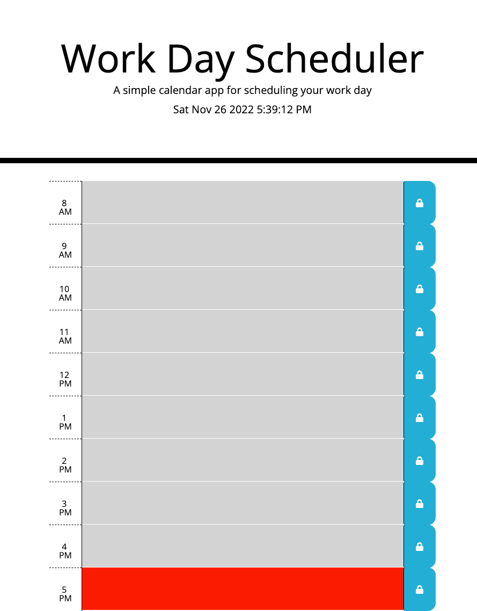

# Work-Day-Scheduler

## Description

For this project, I made a schedule planner for an average work day. By doing this project, I learned how to how to store data in local storage and display that data on the webpage. I also learned how to display the current date and time on a webpage, and how to use jquery to add functionality to a website.

## Table of Contents (Optional)

- [Link to website](#Link)
- [Usage](#usage)
- [Credits](#credits)
- [License](#license)

## Link

https://taylorpahl.github.io/Work-Day-Scheduler/

## Usage

To use this application, click in one of the time blocks and type your plan for that hour of the day. Next, click the button with the lock icon to the right of the time block you've typed in. The information you typed will be saved in the time block until you change the information. Keep in mind, the color of the time blocks changes throughout the day. If a time block is grey, that time has already passed for the day. If a time block is red, that is the current time of day. If a time block is green, that time of day has not happened yet.

## Credits

https://stackoverflow.com/questions/18536726/javascript-to-display-the-current-date-and-time

https://stackoverflow.com/questions/59995703/trying-to-change-background-color-based-off-if-the-hour-is-in-the-past-current

https://stackoverflow.com/questions/40791207/setting-and-getting-localstorage-with-jquery 

https://stackoverflow.com/questions/4825295/onclick-to-get-the-id-of-the-clicked-button

https://www.w3schools.com/icons/tryit.asp?filename=tryicons_fa-lock

## License

Refer to LICENSE in the root folder of repository.

## Features

Features for this project include: Current date and time display, data stored in local storage and displayed of webpage, save button for saving information on webpage, and color changing time blocks based on the time of day.

